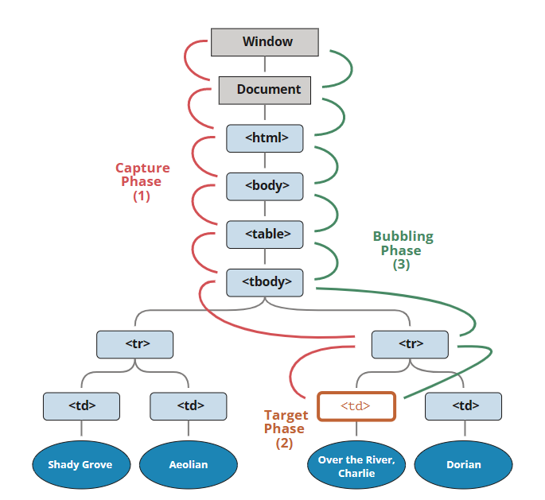

## 事件

### 事件的冒泡和捕获


可以通过设置addEventListener的第三个参数`{capture: true}`来设置在`冒泡阶段`触发，false表示在`捕获阶段`触发


下面是理解事件冒泡和捕获的demo
```html
<style>
  body * {
    margin: 10px;
    border: 1px solid blue;
  }
</style>

<form>FORM
  <div>DIV
    <p>P</p>
  </div>
</form>

<script>
  for(let elem of document.querySelectorAll('*')) {
    elem.addEventListener("click", e => alert(`Capturing: ${elem.tagName}`), true);
    elem.addEventListener("click", e => alert(`Bubbling: ${elem.tagName}`));
  }
</script>
```

处理程序可以访问event对象的属性
- event.target  引发事件的最深层元素
- event.currentTarget( = this)  处理事件的当前元素（具有handler的元素）
- event.eventPhase  当前阶段（capturing=1，target=2，bubbling=3）


### DOM事件对象
事件handler可以访问event对象，event对象包含一些关键属性
| 属性/方法  | 类型  | 读/写  | 说明  |
|---|--|---|---|
| bubbles  | bool  | r  | 表示事件是否冒泡  |
| cancelable  | bool  | r  | 表示是否可以取消事件的默认行为  |
| defaultPrevented  | bool  | r  | true 表示已经调用preventDefault()方法（DOM3Events中新增）  |
| detail  | Number  | r  | 事件其他相关信息  |
| eventPhase  |  Number |  r | 表示调用事件处理程序的阶段：1 代表捕获阶段，2 代表到达目标，3 代表冒泡阶段  |
| preventDefault()  | function  | r  |用于取消事件的默认行为。只有cancelable 为true 才可以调用这个方法   |
| stopImmediatePropagation() | function  | r   | 用于取消所有后续事件捕获或事件冒泡，并阻止调用任何后续事件处理程（DOM3 Events 中新增）  |
| stopPropagation() |  function |  r | 用于取消所有后续事件捕获或事件冒泡。只有bubbles为true 才可以调用这个方法  |
| currentTarget  |  element  | r  | 当前时间处理程序所在的元素  |
| target  | element  | r  | 事件触发的最深层对象  |
| trusted  |  bool | r  | true 表示事件是由浏览器生成的。false 表示事件是开发者通过JavaScript 创建的（DOM3 Events 中新增）  |
| type  | string  |  r | 被触发的事件类型  |
| View  | AbstractView  |  r |  与事件相关的抽象视图。等于事件所发生的window 对象 |

### 事件类型

#### 用户界面时间（UIEvent）
load事件
- 在window对象上，当整个页面（包括所有的外部资源如图片、css、js文件、iframes等）加载完成后触发
- img元素上，当图片加载完成的时候会触发load事件


DOMContentLoaded事件

该事件在HTML文件被完全`加载`并`解析`的情况下触发，不需要等待`stylesheets、images、subframes`加载完成

这里涉及到script的两个标签`async`,`defer`，其中，当script标签被标注为defer的时候，会在js脚本执行完成的时候才触发`DOMContentLoaded`，而且当script标签是module的时候，其天然就是defer的。最好的方式是script标签放置到body下面，这样兼容性问题最小，也最符合直觉


另，defer和async的执行时机有些许的不同，可以用下图进行阐述


## DOM

### 遍历
#### nodeIterator
通过nodeIterator来遍历DOM
`createNodeIterator(root, whatToShow, filter)`
- root element节点
- whatToShow，数字类型，表示只迭代哪种类型的节点，详见mdn
- filter，callback或者object with acceptNode method。用来筛选node

iterator是一个指针，每次都指向一个node节点，采用的遍历方法是`深度优先`遍历


```js
// 获取根节点
var root = document.documentElement;
// 创建nodeIterator对象
var iterator = document.createNodeIterator(root, NodeFilter.SHOW_ELEMENT);
// 遍历节点
var node = iterator.nextNode();
while (node) {
  console.log(node.tagName);
  node = iterator.nextNode();
}
```


#### treeWalker
treeWalker也是一个dom遍历接口，它相对于nodeIterator更加灵活，api提供了更多的方法来协助用户实现自定义遍历，当然通过`nextNode()`实现类似于nodeIterator式的深度优先的遍历。此外它提供了更多的方法支持自定义遍历
- parent.node()
- firstChild()
- lastChild()
- previousSibling()
- nextSibling()
- previousNode() 深度优先遍历
- nextNode() 深度优先遍历
