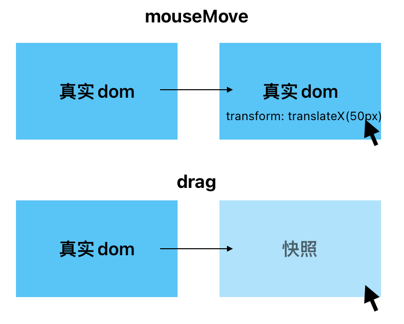
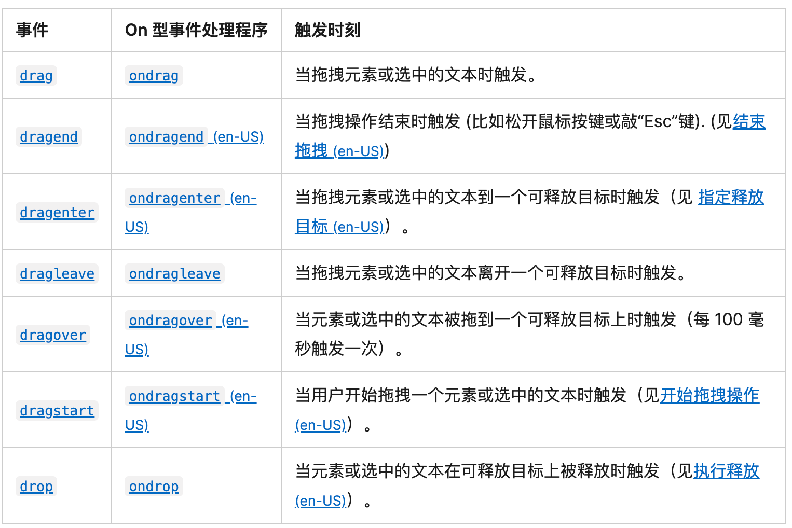

## 拖拽

### 实现原理



- 操作真实的DOM，改变位置
- 通过HTML拖拽API实现

### HTML拖拽API

#### 事件类型



#### 触发位置

| 元素   | 事件名称      |
| ---- | --------- |
| 拖拽块  | dragstart |
|      | drag      |
|      | dragend   |
| 放置区域 | dragenter |
|      | dragover  |
|      | dragleave |
|      | drop      |

#### 数据传输接口

```ts
interface DragEvent {
    readonly dataTransfer: DataTransfer
    ...
}

interface DataTransfer {
    // 获取当前选定的拖放操作类型
    dropEffect: "none" | "copy" | "link" | "move";
    // 可用的操作类型
    effectAllowed: "none" | "copy" | "copyLink" | "copyMove" | "link" | "linkMove" | "move" | "all" | "uninitialized";
    // 数据传输中可用的所有本地文件的列表。如果拖动操作不涉及拖动文件，则此属性为空列表
    readonly files: FileList;
    // DataTransferItem数组及其对应的增删操作
    readonly items: DataTransferItemList;
    // DragStart事件中设置的拖拽类型数组
    readonly types: ReadonlyArray<string>;
    clearData(format?: string): void;
    getData(format: string): string;
    setData(format: string, data: string): void;
    // 设置自定义的拖动图像
    setDragImage(image: Element, x: number, y: number): void;
}

interface DataTransferItem {
    // 拖拽项的种类，string 或是 file
    readonly kind: string;
    // 拖拽项的类型，MIME
    readonly type: string;
    // 对于kind为file的数据，返回file对象
    getAsFile(): File | null;
    // 对于kind为string的数据，返回字符串值
    getAsString(callback: FunctionStringCallback | null): void;
}
```

### 常见拖拽npm库

- [<u>dragula</u>](https://bevacqua.github.io/dragula/)

- [<u>sortblejs</u>](https://sortablejs.github.io/Sortable/)

- [<u>dnd-kit</u>](https://github.com/clauderic/dnd-kit)

- [<u>interactjs</u>](https://github.com/taye/interact.js)


